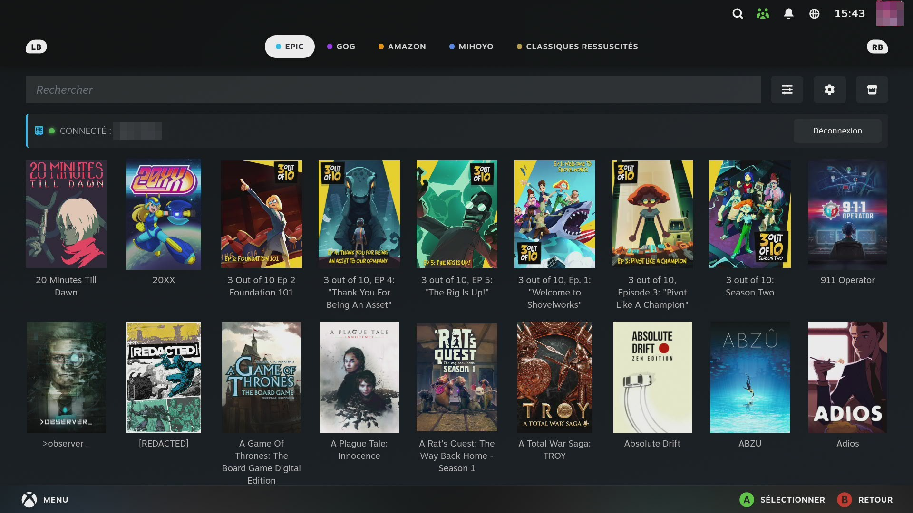
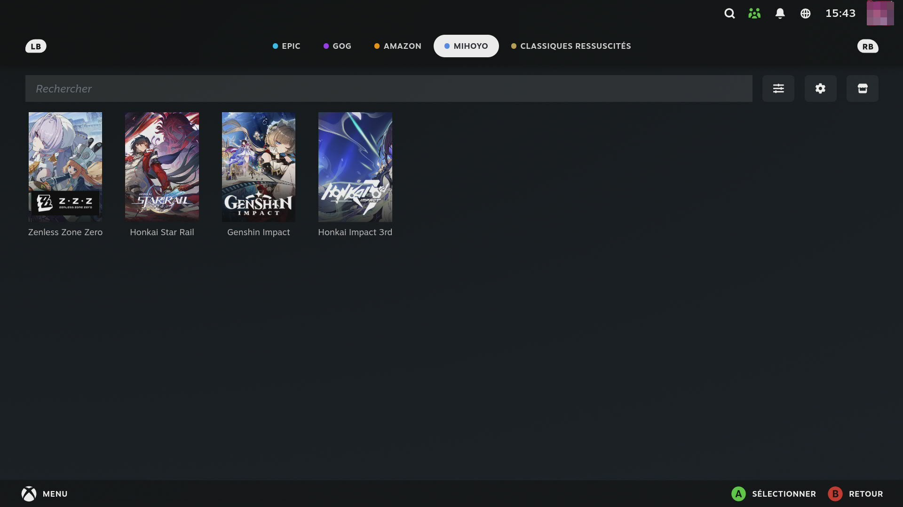
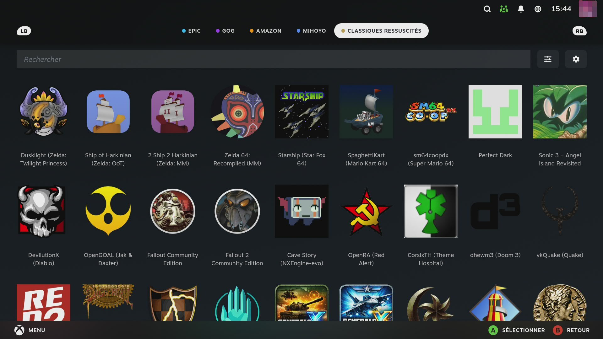
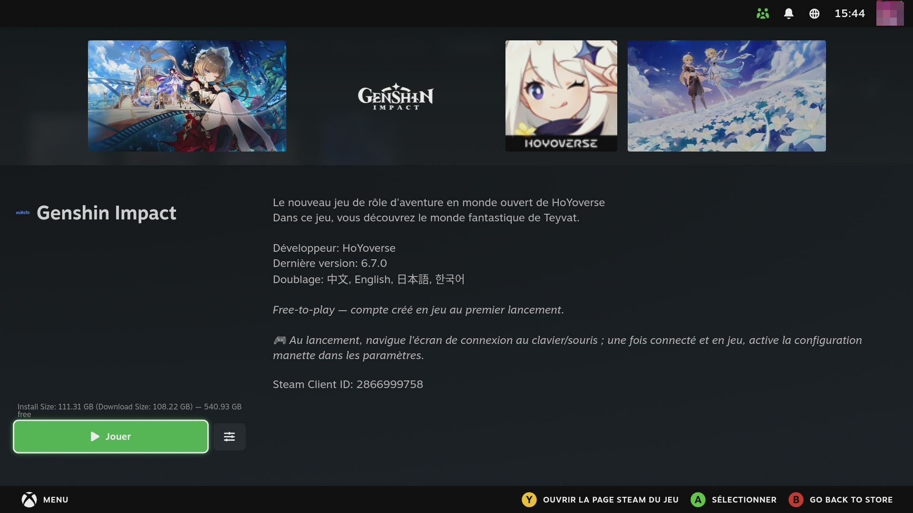
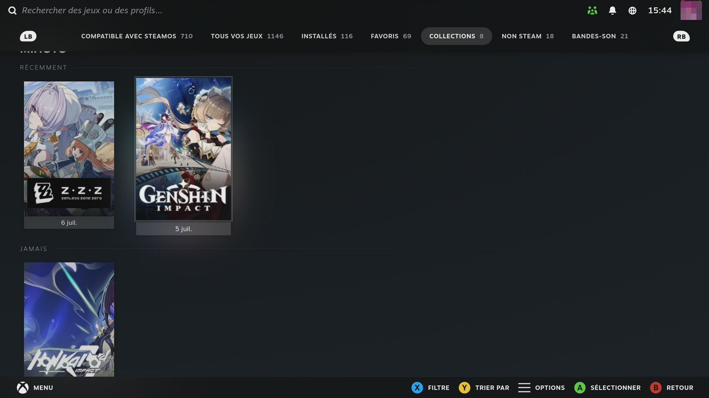
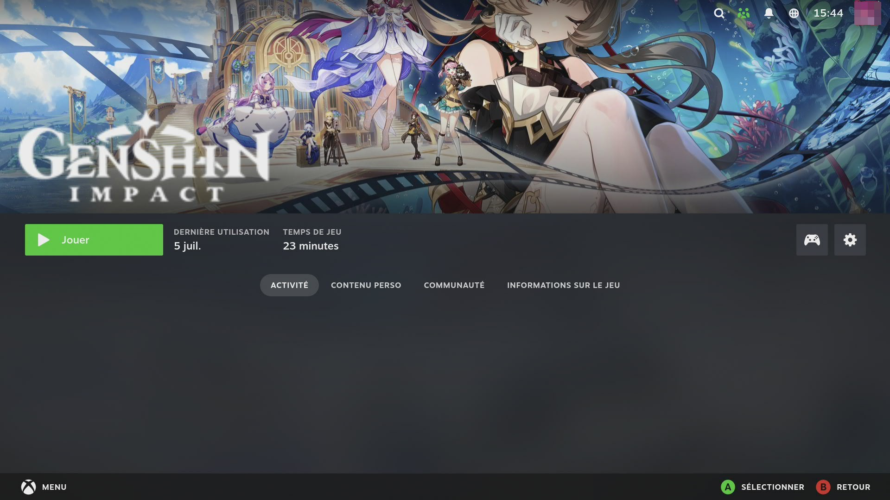

# 🗝️ SkullKey

> 🌐 [EN](../README.md) · [FR](README.fr.md) · [DE](README.de.md) · [ES](README.es.md) · [IT](README.it.md) · [PT](README.pt.md) · [NL](README.nl.md) · [PL](README.pl.md) · [RU](README.ru.md)

**De sleutel die elke winkel opent.** Speel je Epic Games-, GOG- en Amazon Games-bibliotheken rechtstreeks vanuit de gamemodus op SteamOS / Bazzite — inloggen, installeren, starten. Zonder ooit de desktopmodus te gebruiken.

## Functies

- 🎮 **100% gamemodus** — bladeren, inloggen, installeren en spelen zonder de desktop aan te raken
- 🏪 **Vier winkels, gratis** — Epic Games ([Legendary](https://github.com/derrod/legendary)), GOG ([gogdl](https://github.com/Heroic-Games-Launcher/heroic-gogdl)), Amazon Games ([nile](https://github.com/imLinguin/nile)) en **miHoYo/HoYoverse**
- ✨ **miHoYo-winkel** — Genshin Impact, Honkai: Star Rail, Zenless Zone Zero en Honkai Impact 3rd, geïnstalleerd via HoYoverses officiële *sophon*-kanaal: parallelle chunk-downloads (~100 MB/s), updates die alleen gewijzigde bestanden ophalen, hervatten na herstart, anti-cheat automatisch geregeld (jadeite) voor HI3/HSR
- 🩹 **miHoYo-extra's** — delta-updates (alleen het verschil, ~4× kleiner), keuzemenu voor de stemtaal, integriteits**controle & reparatie**, en Zenless Zone Zero-anti-cheat automatisch afgehandeld
- 🏛️ **Classics Reborn** — 52 native opensource-ports & hercompilaties van klassiekers (Zelda, Mario 64, Perfect Dark, Diablo, Fallout, Doom, C&C Generals, Morrowind, Sonic Unleashed, Unreal Tournament, Freespace 2, LEGO Island…), geïnstalleerd vanaf de officiële releases van elk project, met duidelijke instructies voor je originele spelbestanden (9 talen)
- 👥 **Eén winkelruimte per Steam-account (multi-account)** — elke Steam-gebruiker van de machine heeft eigen Epic/GOG/Amazon-logins en bibliotheken; wisselen van Steam-account schakelt alles automatisch om (bestaande logins blijven bij het account dat bij het eerste gebruik actief is)
- 📦 **Auto-update van games** — een dagelijkse achtergrondronde houdt alle geïnstalleerde games actueel, in elke winkel en voor elk account
- 📺 **Media & apps** — extra secties voor Tv & video, Muziek, Cloudgaming en Apps & tools (Netflix, Jellyfin, Kodi, Moonlight, Lutris… 34 geselecteerde apps), automatisch up-to-date gehouden
- 🖼️ **Native ogende snelkoppelingen** — geïnstalleerde games krijgen automatisch Steams officiële artwork (verticale capsule, hero, logo), met GOGs gamesdb als terugval
- 📚 **Steam-collecties** — geïnstalleerde games worden per winkel („Epic", „GOG", „Amazon") gegroepeerd in je bibliotheek
- ⚙️ **Proton beheerd door Steam** — prefixes, instellingen per game en FPS-limieten werken precies zoals bij Steam-games
- 🔄 **Auto-update** — nieuwe versies installeren zichzelf stil op de achtergrond (uit te schakelen in Instellingen)
- 🌐 **9 talen** — de interface volgt automatisch de taal van je console (EN/FR/DE/ES/IT/PT/NL/PL/RU)
- 🕹️ **Snelle toegang** — gekleurde winkelkaarten in het QAM, optionele L3+R3-sneltoets om de winkel overal te openen
- 🐧 **Compatibiliteit** — we werken er actief aan om elk OS te ondersteunen dat Steam in gamemodus / Big Picture kan draaien (voorlopig Linux): portable detectie, geen distributiespecifieke aannames Notities per distributie: [docs/OS-NOTES.md](OS-NOTES.md).

## 📸 Screenshots

<p align="center">
  
  
</p>
<p align="center">
  
  
</p>
<p align="center">
  
  
</p>

## Installatie

Via Decky Loader, zonder desktop:

1. Installeer [Decky Loader](https://decky.xyz/)
2. Zet de **ontwikkelaarsmodus** aan in Decky's algemene instellingen
3. Decky-instellingen → **Ontwikkelaar** → *Plugin installeren vanaf URL*:
   `https://github.com/Necrosiak/SkullKey/releases/latest/download/SkullKey.zip`

Of bouw vanaf de broncode:

```bash
pnpm install && pnpm run build
sudo bash install-local.sh
```

Open daarna de plugin en installeer de winkelafhankelijkheden via **Instellingen → Afhankelijkheden**.

## Gebruik

1. Open het snelmenu (…) → SkullKey
2. Kies een winkelkaart (Epic / GOG / Amazon) en log in
3. Installeer een game — hij verschijnt in je Steam-bibliotheek met artwork, in een collectie per winkel
4. Spelen!

## 🐛 Issues & ideeën — aarzel niet!

Een bug, iets dat hapert, vreemd gedrag op jouw distributie? Een idee?
**Open een [issue](https://github.com/Necrosiak/SkullKey/issues)** — elke
melding bepaalt direct mee wat er hierna wordt gebouwd, en geen melding is te
klein. Om snel te kunnen fixen, vermeld als het kan:

- je distributie & versie (Bazzite 42, CachyOS, Ubuntu 24.04…) en hoe Steam draait (Gaming Mode / Big Picture / desktop)
- de pluginversie (Instellingen → Over) en de betrokken store/tab
- wat je deed, wat je verwachtte, wat er in plaats daarvan gebeurde
- logs: `~/homebrew/logs/SkullKey/` (afhankelijkheidsproblemen: `ensure_deps.log`)

Featureverzoeken en "het werkt!"-meldingen op ongewone setups zijn net zo
waardevol — ze vertellen ons wat we hierna moeten ondersteunen.

## Credits

SkullKey is een fork van [Junk-Store](https://github.com/ebenbruyns/junkstore) van **Eben Bruyns** (BSD-3-Clause) — bedankt voor het solide fundament. Winkel-engines: [Legendary](https://github.com/derrod/legendary), [heroic-gogdl](https://github.com/Heroic-Games-Launcher/heroic-gogdl) en [nile](https://github.com/imLinguin/nile).

Onafhankelijk communityproject, niet gelieerd aan Junk-Store, Valve, Epic Games, GOG of Amazon.

## Licentie

BSD-3-Clause — zie [LICENSE](../LICENSE).
